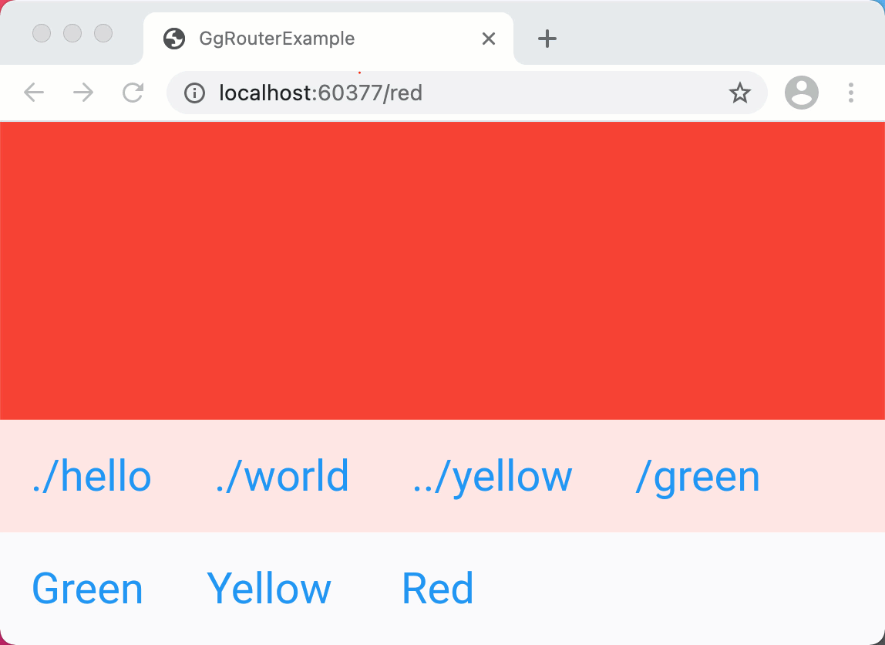

# Easy to use routing and navigation for flutter

`GgRouter` offers an intuitive way to synchronize a Flutter app with the browser
URI. Nested routes are defined as nested widgets. Tools are provided to navigate
relatively or absolutely to children, parents, and siblings.

## Activate GgRouter

In order to activate `GgRouter`, you need to create a `MaterialApp.router(...)`
and provide it with an instance of `GgRouterDelegate` and
`GgRouterInformationParser`.

~~~dart
class MyApp extends StatelessWidget {
  MyApp({Key? key}) : super(key: key);

  @override
  Widget build(BuildContext context) {
    return MaterialApp.router(
      routerDelegate: GgRouterDelegate(
        child: Scaffold(
          body: GgRouterExample(),
        ),
      ),
      routeInformationParser: GgRouteInformationParser(),
    );
  }
}
~~~

## Define routes

### Basic routes

Use `GgRouterWidget` to add routes to your application structure:

~~~dart
@override
Widget build(BuildContext context){
  GgRouterWidget({
    'sports':         _sports,
    'transportation': _transportation,
    'places':         _places
  })
}
~~~

### Nested routes

Each of the three widgets `_sports`, `_transportation` and `_places` can define
its own sub routes:

~~~dart
Widget _sports(BuildContext context){
  return Container(
    child: {
      GgRouterWidget({
        'basketball': _basketBall,
        'football': _footBall,
        'handball': _handBall,

      });
    }
  );
}
~~~

### Index route

The example above allows now routes like `/sports/basketball`. But what happens
if one opens the route `/sports`? By default `GgRouter` navigates to the first
route, i.e. the `basketball` route. To specify a widget that is shown when
`/sports` is called, just add a empty named route:

~~~dart
Widget _sports(BuildContext context){
  return Container(
    child: {
      GgRouterWidget({
        '': _index, // The index route, shown one navigates to "/sports".
        'basketball': _basketBall,
        'football': _footBall,
        'handball': _handBall,

      });
    }
  );
}
~~~

## Navigation

Use `GgRouter.of(context).navigateTo(path)` to get the current context's router.
By specifying an absolute or relative `path` you can now navigate to other
places.

### Absolute navigation

Use `navigateTo('/sports/football')` to navigate to the football page, no matter
where you currently are in your application.

### Relative navigation

Imagine you are in the context of the `/sports` route. Use
`navigateTo('./basketball')` to switch to the handball page. You can also jump
to deeply nested children by calling something like
`navigateTo('./basketball/dialog')`.

### Navigate to a parent route

Imagine you are in the context of the `/sports/basketball` route. Use
`navigateTo('../')` to navigate to the parent route. In the example we use that
method to close the dialog.

### Restore last routes

After jumping from "Transportation" to "Sports" the previously opened sports
page appears. This is achieved by using the keyword `_LAST_`. When one clicks on
"Sports", `navigateTo('/sports/_LAST_')` is executed.

## Error handling

If one opens a URI in the browser that is not defined using `GgRouterWidget(...)`, the
route last active is kept. But you might want to handle that error and show an
error message. To do so, assign an error handler to `GgRouter.of(context).errorHandler`.

## Navigation buttons

### Combining route and navigation elements

`GgRoute` allows it to handle navigation code and route code side by side.

In the example the following pattern is applied:

~~~txt
  |-MaterialApp
    |-appBar
    |  |-actions
    |  |  |-sports
    |  |  |-transportation
    |  |  |-button
    |-routes
       |-sports
       |-transportations
       |-places
~~~

To navigate to the sports page, the sports button needs to use
`GgRouter.of(context)` to get a reference to the current router. From here it
can call  `navigateTo('./sports')` to navigate to the sports page.

### Highlighting active route buttons

`GgRouter.of(context)` provides several methods a button can use to decide if it
needs to be highlighted or not:

- `routeNameOfActiveChild`
- `indexOfActiveChild`

