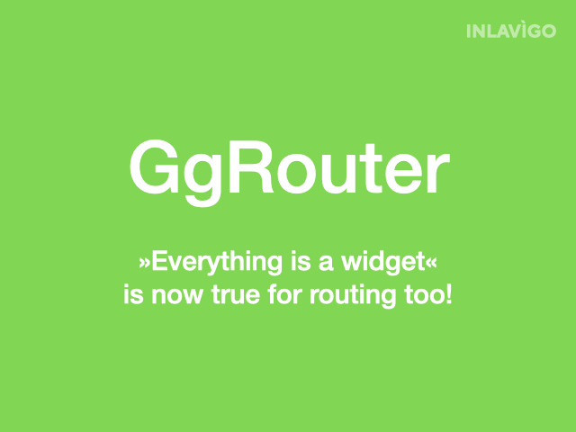

# GgRouter - Easy Routing for Flutter

A good routing and navigation system opens many doors: Deeply link to any place
in your app. Navigate with ease from one widget to another. Restore the exact
state of your app. GgRouter gives you a simple and powerful routing library for
flutter built on the top of Navigator 2.0.

With `GgRouter` routes and query params can be nested in the same way widgets
are nested. Out of your widget and route hierarchy, `GgRouter` creates and
maintains a route tree. When you navigate through the route tree, `GgRouter`
will build the right widgets for you.

## Activate GgRouter

To activate `GgRouter`, create a `MaterialApp.router(...)`
and provide it with an instance of `GgRouterDelegate` and
`GgRouterInformationParser`.

~~~dart
class MyApp extends StatelessWidget {
  MyApp({Key? key}) : super(key: key);

  @override
  Widget build(BuildContext context) {
    return MaterialApp.router(
      routerDelegate: GgRouterDelegate(
        child: Scaffold(
          body: GgRouterExample(),
        ),
      ),
      routeInformationParser: GgRouteInformationParser(),
    );
  }
}
~~~

## Define routes

### Basic routes

Use the `GgRouter` widget to add routes to your application structure:

~~~dart
@override
Widget build(BuildContext context){
  GgRouter({
    'sports':         _sports,
    'transportation': _transportation,
    'places':         _places
  })
}
~~~

### Index route

To define a default route which is shown when none of the routes is selected,
add a route with an empty `''` name:

~~~dart
@override
Widget build(BuildContext context){
  GgRouter({
    '': _index,
    'sports': _sports,
    // ...
  })
}
~~~

### Nested routes

You can arbitrarily nest routes. Just place another `GgRouter` widget within
one of the routes. Child `GgRouter` widgets do not need to be direct children.

## Navigation

### Navigate absolutely

Use `GgRouter.of(context).navigateTo('/sports/football')` to absolutely navigate
to the football page, no matter where you currently are in your application.

### Navigate relatively

- Use `GgRouter.of(context).navigateTo('./dialog/')` to navigate to the direct child.
- Use `GgRouter.of(context).navigateTo('..')` to navigate to the parent.
- Use `GgRouter.of(context).navigateTo('../../')` to navigate to the grand parent.
- Use `GgRouter.of(context).navigateTo('../transportation/')` to navigate to a sibling.

### Navigate to last route

When you switch to a route, you might want to open the child route that was
opened when you left the route the last time. Use the `_LAST_` keyword to
activate this route:

~~~dart
GgRouter.of(context).navigateTo('/sports/_LAST_');
~~~

### Navigation Bars

Navigation buttons and `GgRouter` widgets can be used side by side. Navigation
elements can use `GgRouter.of(context)` to perform various routing operations:

- Use `GgRouter.of(context).navigateTo('...')` to navigate to a route.
- Use `GgRouter.of(context).routeNameOfActiveChild` to find out which child
  route is currently active.
- Use `GgRouter.of(context).indexOfActiveChild` to find out which of the items
  in a `BottomNavigationBar` need to be styled as active elements.
- Use `GgRouter.of(context).onActiveChildChange` to rebuild the navigation bar,
  when the active child changes.

## URI query params

### Define query params

Use `GgRouteParams` to define a list of query params that are shown in the URI.

~~~dart
GgRouteParams(
  params: {
    'a': GgRouteParam<bool>(seed: false),
    'b': GgRouteParam<int>(seed: 5),
    'c': GgRouteParam<String>(seed: 'hello'),
  },
  child: // ...
}
~~~

The param names `a`, `b`, and `c` must only be used one time in a route path.
Different route paths can define the same parameter names. When switching a
route, also the route parameters will change.

### Access query params

To use the value of a query param in a widget, use these method:

- Use `GgRouter.of(context).param('a')?.value` to get or set the value of the
  query param `a`.
- Use `GgRouter.of(context).param('a')?.stream` to observe value changes of
  query param `a`.

## Error handling

If you open a URI in the browser that is not defined using `GgRouter(...)`, an
error is thrown. To handle that error, assign an error handler to
`GgRouter.of(context).errorHandler`.

## Example

An example demonstrating all of the features above can be found in `example/main.dart`.

## Features and bugs

Please file feature requests and bugs at [GitHub](https://github.com/inlavigo/gg_router).